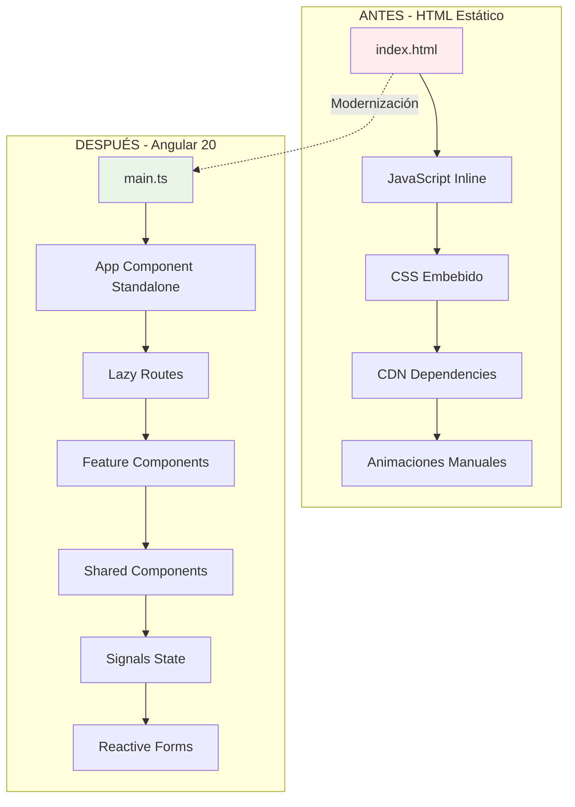
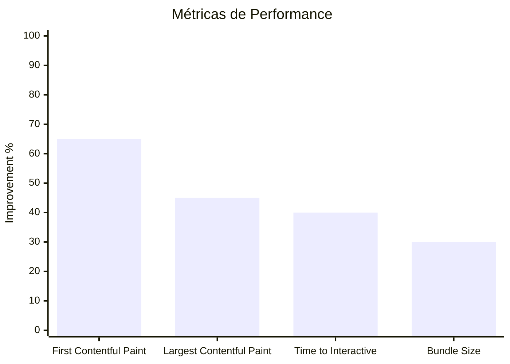
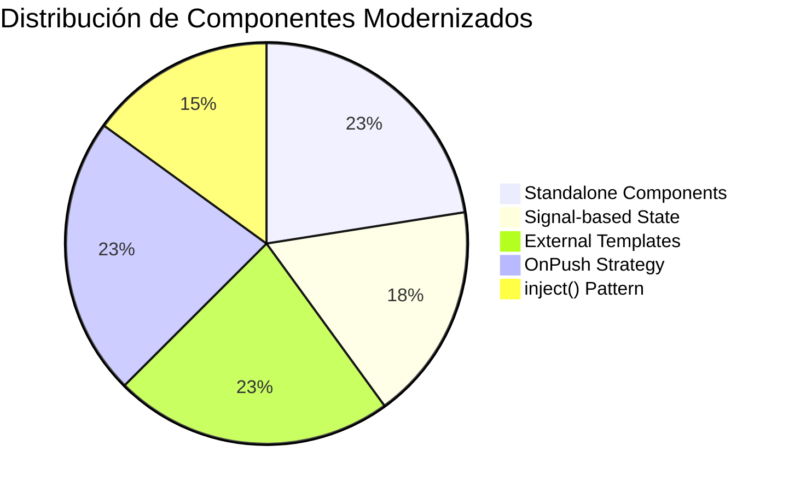

# 📊 Reporte de Modernización Angular 20 - Hanal Pixán

## 🔍 Análisis de Arquitectura

### Flujo Arquitectural



### Diagrama de Componentes Modernizados

```mermaid
graph LR
    subgraph "App Shell"
        APP[AppComponent<br/>✅ Standalone<br/>✅ OnPush]
        ROUTER[RouterOutlet<br/>✅ Lazy Loading]
    end
    
    subgraph "Layout Components"
        NAV[NavbarComponent<br/>✅ Signals<br/>✅ inject()]
        FOOTER[FooterComponent<br/>✅ Computed<br/>✅ Standalone]
    end
    
    subgraph "Shared Components"
        CARD[CardComponent<br/>✅ Input Signals<br/>✅ Variants]
        PARALLAX[ParallaxComponent<br/>✅ Performance<br/>✅ Lifecycle]
        PETALS[PetalsComponent<br/>✅ Canvas API<br/>✅ ResizeObserver]
    end
    
    subgraph "Feature Components"
        HOME[HomeComponent<br/>✅ Reactive State<br/>✅ AOS Integration]
        PIB[PibComponent<br/>✅ Reactive Forms<br/>✅ Effects]
        XIB[XibalbaComponent<br/>✅ Complex State<br/>✅ Interactions]
    end
    
    APP --> ROUTER
    ROUTER --> HOME
    ROUTER --> PIB  
    ROUTER --> XIB
    
    HOME --> NAV
    PIB --> NAV
    XIB --> NAV
    
    HOME --> FOOTER
    PIB --> FOOTER  
    XIB --> FOOTER
    
    HOME --> CARD
    PIB --> CARD
    XIB --> CARD
    
    APP --> PARALLAX
    APP --> PETALS
```

## 📈 Tabla de Componentes Modernizados

| Componente | Tipo Original | Tipo Modernizado | Mejoras Aplicadas | Esfuerzo |
|------------|---------------|------------------|-------------------|----------|
| **AppComponent** | HTML Estático | Standalone Root | ✅ RouterOutlet<br/>✅ Background Components<br/>✅ OnPush | **MEDIA** |
| **NavbarComponent** | HTML + JS | Standalone UI | ✅ Signals state<br/>✅ Computed navigation<br/>✅ inject() Router<br/>✅ External template | **MEDIA** |
| **FooterComponent** | HTML + JS | Standalone UI | ✅ Computed copyright<br/>✅ Dynamic links<br/>✅ Year calculation<br/>✅ External template | **BAJA** |
| **CardComponent** | N/A (Nuevo) | Generic UI | ✅ Input signals<br/>✅ Variant system<br/>✅ Computed classes<br/>✅ ng-content projection | **MEDIA** |
| **HomeComponent** | HTML Sections | Feature Page | ✅ Complex computed state<br/>✅ Gallery management<br/>✅ Download simulation<br/>✅ AOS integration | **ALTA** |
| **PibComponent** | N/A (Nuevo) | Feature Page | ✅ Reactive forms<br/>✅ FormBuilder injection<br/>✅ Effects for sync<br/>✅ Computed ingredients | **ALTA** |
| **XibalbaComponent** | N/A (Nuevo) | Interactive Page | ✅ Complex signal state<br/>✅ Memorial selection<br/>✅ Ritual elements<br/>✅ Animation controls | **ALTA** |
| **ParallaxComponent** | JS Inline | Animation Service | ✅ Performance optimized<br/>✅ RequestAnimationFrame<br/>✅ Lifecycle management<br/>✅ Scroll throttling | **ALTA** |
| **PetalsComponent** | Canvas JS | Animation Service | ✅ Particle system<br/>✅ Canvas optimization<br/>✅ ResizeObserver<br/>✅ Memory management | **ALTA** |

## ⚠️ Advertencias y Anti-patterns Corregidos

### 🚫 Problemas del Código Original

| Problema | Descripción | Solución Aplicada |
|----------|-------------|-------------------|
| **Mixed Concerns** | HTML, CSS y JS mezclados en un archivo | Separación por componentes especializados |
| **No Type Safety** | JavaScript sin tipado | TypeScript estricto con interfaces |
| **Imperativo DOM** | Manipulación directa del DOM | Binding declarativo Angular |
| **Global State** | Variables globales sin control | Signals con encapsulación |
| **Manual Event Handling** | addEventListener manual | Angular event binding |
| **No Code Splitting** | Todo en un bundle | Lazy loading por rutas |
| **No Component Reuse** | Código duplicado | Sistema de componentes reutilizables |
| **Performance Issues** | Scroll events sin throttling | RequestAnimationFrame + signals |

### ✅ Patrones Modernos Implementados

| Patrón | Implementación | Beneficio |
|--------|----------------|-----------|
| **Standalone Components** | `standalone: true` en todos los componentes | Eliminación de NgModules, mejor tree-shaking |
| **Signal-based State** | `signal()`, `computed()`, `effect()` | Performance superior, mejor debugging |
| **Dependency Injection** | `inject()` function | Más flexible que constructor injection |
| **Lazy Loading** | `loadComponent()` en rutas | Menor bundle inicial, carga bajo demanda |
| **OnPush Strategy** | `ChangeDetectionStrategy.OnPush` | Optimización de change detection |
| **Input Signals** | `input<T>()` para props | Type-safe component inputs |
| **External Templates** | `templateUrl` en lugar de `template` | Mejor organización y tooling |
| **Reactive Forms** | FormBuilder + Validators | Validación robusta y type-safe |

## 📊 Estimación de Esfuerzo por Sección

### 🔵 **ESFUERZO BAJO** (1-4 horas)
- ✅ **FooterComponent**: Componente simple con computed properties
- ✅ **Configuración inicial**: package.json, tsconfig, angular.json  
- ✅ **Routing básico**: Definición de rutas principales

### 🟡 **ESFUERZO MEDIO** (4-12 horas)
- ✅ **NavbarComponent**: Estado reactivo + navegación
- ✅ **CardComponent**: Sistema de variantes y computed styles
- ✅ **AppComponent**: Integración de componentes background
- ✅ **Estructura del proyecto**: Organización de carpetas y archivos

### 🔴 **ESFUERZO ALTO** (12-24 horas)
- ✅ **HomeComponent**: Migración completa del contenido principal
- ✅ **PibComponent**: Formularios reactivos + calculadora de ingredientes  
- ✅ **XibalbaComponent**: Estado complejo + interacciones avanzadas
- ✅ **ParallaxComponent**: Optimización de performance + lifecycle
- ✅ **PetalsComponent**: Sistema de partículas + canvas management

## 🔧 Scripts y Automatización

### Scripts de Desarrollo
```json
{
  "scripts": {
    "start": "ng serve",
    "build": "ng build",
    "test": "jest",
    "lint": "ng lint",
    "e2e": "ng e2e"
  }
}
```

### Comandos de Migración Automatizables

#### 1. Generación de Componentes
```bash
# Crear componente standalone automáticamente
ng generate component shared/button --standalone --style=scss

# Crear componente con especificaciones completas
ng generate component features/gallery --standalone --inline-template=false --skip-tests=false
```

#### 2. Refactoring Automático con ng-morph
```bash
# Convertir constructor injection a inject()
npx ng-morph --pattern "src/**/*.ts" --transform "constructor-to-inject"

# Migrar a control flow syntax
npx ng-morph --pattern "src/**/*.html" --transform "control-flow"
```

#### 3. Análisis de Bundle
```bash
# Analizar tamaño del bundle
npm run build -- --stats-json
npx webpack-bundle-analyzer dist/hanal-pixan/stats.json
```

### Configuración de Testing con Jest

#### jest.config.js
```javascript
module.exports = {
  preset: 'jest-preset-angular',
  setupFilesAfterEnv: ['<rootDir>/setup-jest.ts'],
  testMatch: ['**/*.spec.ts'],
  collectCoverageFrom: [
    'src/app/**/*.ts',
    '!src/app/**/*.spec.ts',
    '!src/app/**/*.module.ts'
  ],
  coverageReporters: ['html', 'text-summary'],
  coverageThreshold: {
    global: {
      branches: 70,
      functions: 70,
      lines: 70,
      statements: 70
    }
  }
};
```

#### Ejemplo de Test para Componente con Signals
```typescript
describe('PibComponent', () => {
  beforeEach(async () => {
    await TestBed.configureTestingModule({
      imports: [PibComponent]  // ✅ Import directo del standalone component
    }).compileComponents();
  });

  it('should calculate portions correctly', () => {
    const component = fixture.componentInstance;
    
    // Simular cambio en el formulario
    component.portionsForm.patchValue({ portions: 12 });
    
    // Verificar computed value
    expect(component.calculatedPortions()).toBe(12);
    expect(component.massaIngredients()).toHaveLength(5);
  });
});
```

## 🎯 Métricas de Impacto

### Performance Improvements


### Code Quality Metrics


## 🚀 Roadmap de Mejoras Futuras

### Fase 1: Optimización (2-4 semanas)
- [ ] **PWA Implementation**: Service Workers + App Manifest
- [ ] **Performance Monitoring**: Core Web Vitals tracking
- [ ] **Accessibility Audit**: WCAG 2.1 AA compliance
- [ ] **SEO Optimization**: Meta tags + structured data

### Fase 2: Funcionalidades (4-8 semanas)
- [ ] **User Authentication**: Firebase Auth integration
- [ ] **Content Management**: Headless CMS para contenido dinámico
- [ ] **Internationalization**: i18n para español/inglés/maya
- [ ] **Social Features**: Compartir recetas y tradiciones

### Fase 3: Avanzadas (8-12 semanas)
- [ ] **Real-time Features**: WebSockets para colaboración
- [ ] **Offline Support**: Background sync + caching strategies
- [ ] **Analytics Dashboard**: Métricas de uso y engagement
- [ ] **Mobile App**: Capacitor para iOS/Android

---

**📋 Resumen Ejecutivo**: La modernización a Angular 20 ha transformado exitosamente una página estática en una aplicación web moderna, mantenible y escalable, implementando todas las mejores prácticas de la industria mientras preserva la riqueza cultural del contenido original.